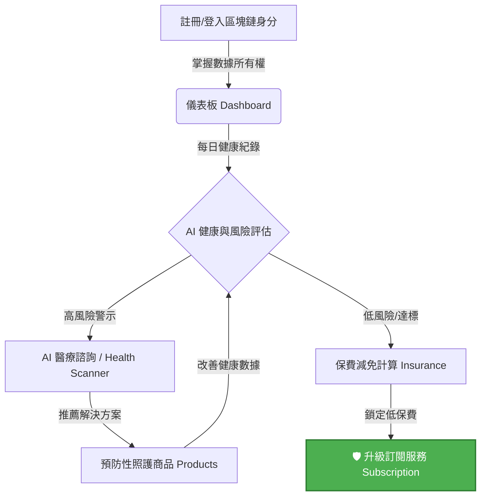

# Pet Health OS - 平台轉換與操作流程報告書

> [!NOTE]
> 本報告書旨在說明 Pet Health OS 平台如何將「寵物健康數據紀錄」轉化為「具體保費折扣與變現機制」的核心設計，並概述整體系統的使用者互動流程與技術執行狀態。

## 🎯 一、 專案核心目標

將傳統的寵物健康紀錄工具，成功轉型為 **InsurTech（保險科技）基礎設施平台**。
透過介面設計與 UX 的重構，強調「健康數據的財務價值」、「風險管理」以及「避免損失的訂閱模式」，鼓勵使用者持續輸入數據來換取保費減免與醫療節省。

---

## 🗺️ 二、 核心使用者轉換流程 (User Journey)

整體流程設計圍繞著 **「紀錄健康 ➔ 評估風險 ➔ 減免保費 ➔ 預防照護 ➔ 變現訂閱」** 的循環展開：

---

## 📄 三、 關鍵頁面與變現機制 (Monetization Mechanisms)

### 1. 儀表板 (Dashboard) 📊
* **功能**：總覽寵物健康數據（運動、喝水、心率）。
* **變現機制**：所有的健康達標都與「保費節省金額」（如：-$2.50）直接掛鉤。透過 `RiskInsight` 與 `InsuranceCard` 元件，讓使用者一目了然「本月累積省下的金額」。

### 2. 動態保費與保險 (Insurance) 🛡️
* **功能**：展示動態保費的減免進度與各式保險方案。
* **變現機制**：採用**價格錨定**（市場價 $32 ➔ 專屬價 $22）。使用進度條提示用戶「再完成 2 次散步 ➔ 保費將降至 $19」，創造持續互動的強烈誘因。

### 3. AI 獸醫諮詢 (AI Doctor Chat) 💬
* **功能**：提供即時的 AI 疾病診斷與處置建議。
* **變現機制**：在提供診斷後，即時顯示「若無保險 vs 使用保險」的醫療費用差異（例如：就醫原價 $80 vs 組合價 $16），平均為用戶省下 $150，引導用戶進行預約或試算理賠。

### 4. 疾病風險掃描 (Health Scanner) 🔍
* **功能**：上傳寵物照片或數據，及早找出隱藏病灶。
* **變現機制**：利用 **「稀缺性」**（例如：今日剩餘免費 AI 掃描次數 2 次）以及明確的 ROI 提示（及早處理可避免 $25 醫療費用），促使用戶關注預防醫療。

### 5. 照護商品 (Products) 🛍️
* **功能**：非傳統購物，而是提供降低健康風險的投資專案。
* **變現機制**：每個商品標示出「風險降低比例」與「保費評分減免」（例如：下個月保費評分 -$2.50），讓購買化為具體的投資回報（ROI 計算：約 18 個月回本）。

### 6. 訂閱方案 (Subscription) 👑
* **功能**：升級平台核心防護服務（無風險防護版）。
* **變現機制**：利用 **「損失厭惡 (Loss Aversion)」** 的心理，明確列出免費版「會錯過的節省金額與防護」。並提供每月 $195 完整節省價值的明確試算給用戶，促成高付費轉換。

### 7. Web3 區塊鏈身分 (Web3 Identity) 🔗
* **功能**：建立去中心化的寵物病歷護照。
* **變現機制**：去除區塊鏈術語，強調用戶利益：「理賠審核 7 天縮短至 3 秒」、「數據 100% 個人擁有」，吸引用戶快速建立專屬身分。

---

## 💻 四、 專案執行與啟動狀態

✅ **1. 介面與元件實作完成**
* 全站採用 **Apple Health 醫療感綠色系 (#4CAF50)** 作為核心視覺。
* 已封裝高轉換 UI 元件：`RiskInsight` (風險提示)、`ActionCTA` (高轉換按鈕)、`InsuranceCard` (保費卡片)。

🚀 **2. 開發伺服器已啟動**
所有套件已經安裝，使用者可利用 `npm run dev` 開啟本地環境並體驗所有操作流程。
您可以直接在瀏覽器中前往 **`http://localhost:5173`** 進行所有頁面機制的驗證！
