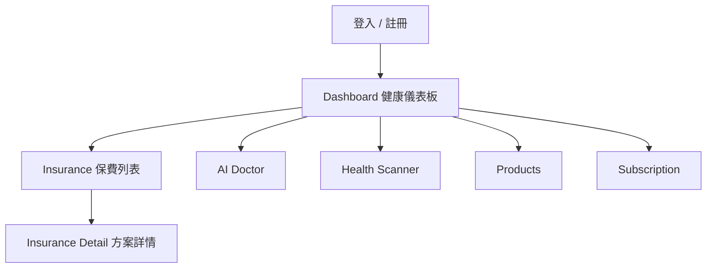

# Pet Health OS Frontend

Consumer-facing frontend for Pet Health OS.

## Product Focus

這個前端目前以「健康數據驅動保費優化」為主軸，核心路徑是：



目前保險列表主資料源已改為 provider insurance catalog，同步自 consumer API，不再使用 `affiliates` 作為保費主列表來源。

## Local Setup

```bash
npm install
VITE_API_URL=http://127.0.0.1:8010/api npm run dev -- --host 127.0.0.1 --port 4177
```

如果要搭配完整 marketplace demo，一起啟動：

- provider backend：`/Users/onesixlin/pet-health-os-api`
- consumer API：`/Users/onesixlin/UI-Conversion-Implementation-Plan-API`

## Demo Account

- `testUser@email.com`
- `password123`

登入後可直接查看：

- `/`
- `/insurance`
- `/insurance/:planId`

## Insurance Experience

`/insurance` 目前會顯示：

- 保費折扣 banner
- 依 pet profile 排序後的保險方案卡片
- provider name
- plan name
- premium range
- badges
- why recommended
- CTA：`查看方案詳情`

`/insurance/:planId` 目前會顯示：

- provider identity
- pricing
- eligibility
- coverage summary
- waiting period
- exclusions
- claim requirements
- score breakdown
- terms url

## Demo Marketplace

當 consumer API 完成 catalog sync 後，目前前端可看到的 provider marketplace 來源包含：

- `Aurora PetCare Insurance`
- `Summit Pet Mutual`
- `Harbor Companion Insurance`

以 demo pet `Bella` 為例，目前可見方案包含：

- `Aurora Precision Care`
- `Summit Total Care`
- `Harbor Active Paws Plus`
- `Summit Accident Shield`
- `Aurora Everyday Flex`

## Current Visual Direction

- 全站以綠色系作為健康與保費優化的主視覺
- dashboard 著重折扣、風險評分與最近健康紀錄
- insurance 頁面已切換成 marketplace card layout
- detail page 以保險方案的可比較資訊為主

## Build

```bash
npm run build
```
